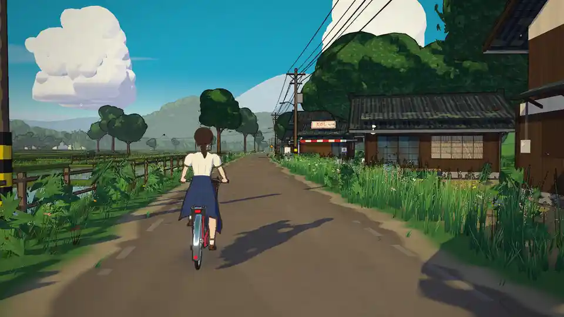
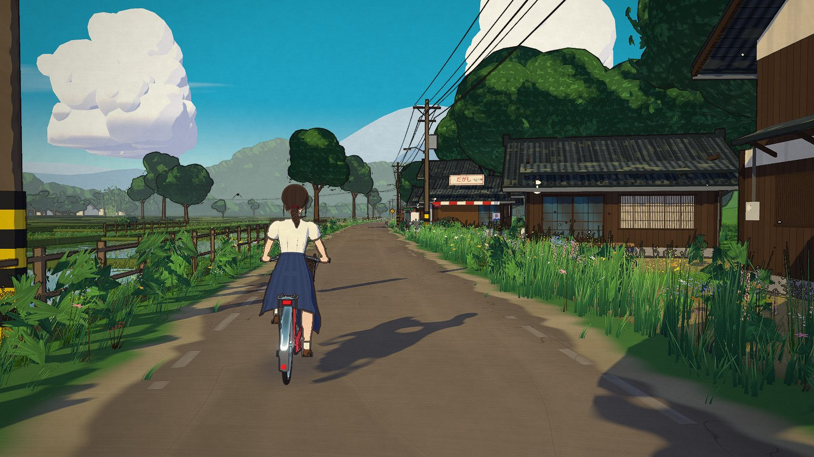
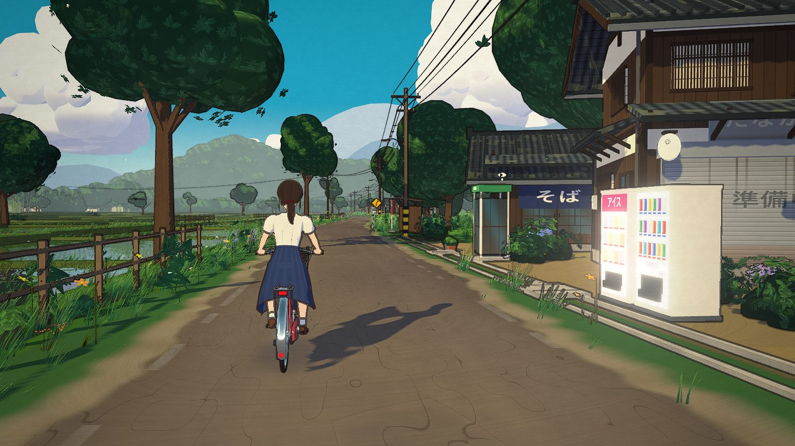
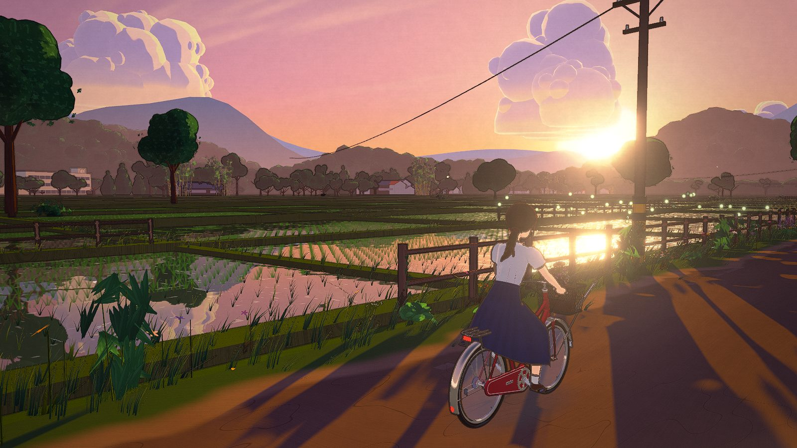
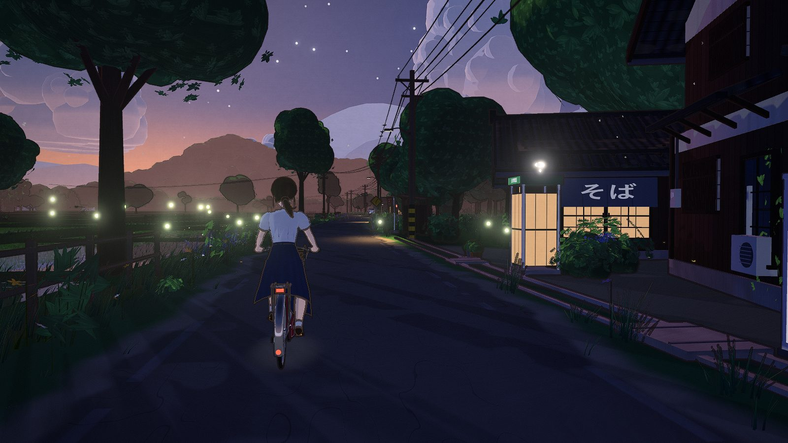
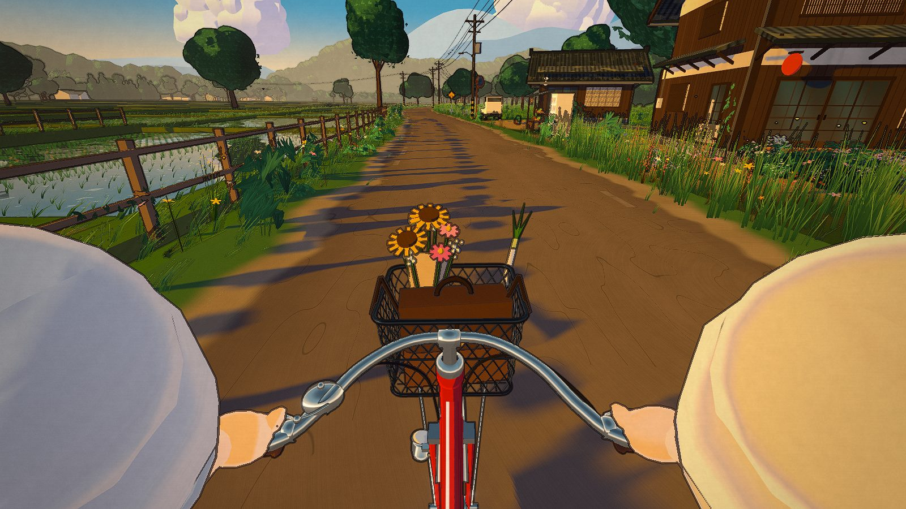
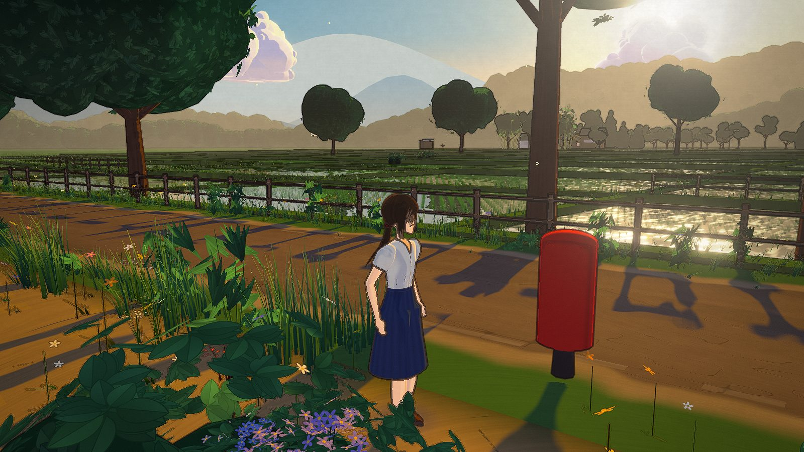

# Summer Cycle

A bicycle ride down a Japanese country road on a late-summer afternoon, drawn in the manner of a
Ghibli or Makoto Shinkai background painting and built in Three.js. There is no score and nothing
to win; you ride past flooded paddies, a row of old wooden shops and power lines sagging over the
road, and the sun goes down if you let it. Everything on screen and everything you hear is
generated in code at load time: the meshes, the leaf atlas the trees are painted with, the
Japanese shop signs, the clouds, and every sound, which is synthesized with the Web Audio API.
The repository ships no image, model or audio files.



*Captured from the running build with `tools/reel.mjs`, one simulated frame at a time. Nothing in
it is composited or edited.*

**Ride it: https://starknightt.github.io/summer-cycle/**

For a hands-off recording: [`?autoplay=1`](https://starknightt.github.io/summer-cycle/?autoplay=1)
rides by itself with no UI, and
[`?autoplay=1&timelapse=1`](https://starknightt.github.io/summer-cycle/?autoplay=1&timelapse=1)
sets the sun from afternoon to dusk over 40 seconds.

**The brief it was built from: [PROMPT.md](PROMPT.md).**

It wants a desktop GPU and a Chromium-based browser. It was built and measured on an RTX 4060.

## Running it locally

```
git clone https://github.com/StarKnightt/summer-cycle.git
cd summer-cycle
pnpm install
pnpm dev        # http://localhost:5421
pnpm build      # type-check, then a production build into dist/
pnpm preview    # serve dist/ on http://localhost:5420
```

The only runtime dependency is `three`. The build uses a relative base, so `dist/` works from any
sub-path; every push to `master` deploys it to GitHub Pages through
`.github/workflows/pages.yml`.

The Playwright scripts need a running build (`pnpm preview`): `scripts/explore.mjs` checks on-foot
mode, collisions, the cameras and the console; `scripts/perf.mjs` runs the 40-second autoplay with
the GPU profiler; `tools/reel.mjs` captures the media in this README. `audio-lab.html` is a
development-only sound playground served by `pnpm dev`.



## Controls

| Input | Action |
|---|---|
| Click | Start the ride: goes fullscreen and locks the pointer (audio starts on the first click or key) |
| Mouse | Look around: orbit the chase camera, or turn her head in first person; eases back when idle |
| W / Up | Pedal harder; she cruises on her own |
| S / Down | Brake; held at a standstill, walk the bike backward |
| A D / Left Right | Steer |
| Shift | Sprint while riding (13.5 m/s instead of 10.5); jog while on foot |
| F | Get off and walk; next to the bike, get back on. Out of reach, F wheels the bike over to her |
| C | Cinematic cameras: chase, front tracking shot, side tracking shot |
| V | Third person / first person |
| T | Time of day: afternoon, golden hour, sunset, dusk |
| B | Ring the bell |
| M | Mute |
| Esc (tap) | Pause; tap again, Enter, Space or click to resume. Switching tabs or windows also pauses |
| Esc (hold) | Release the pointer only, without pausing; click the scene to take it again |

In Chromium, fullscreen also locks the Esc key to the game (Keyboard Lock), so a tap and a hold can
be told apart; hold Esc for a couple of seconds to leave fullscreen. Autoplay pauses on Esc too and
never resumes on its own.

On foot, W A S D walk relative to the camera, the mouse orbits it and the wheel zooms. She can
wander the verges, the lots around the houses and the paddy banks, but not the water, the houses,
the poles, the trunks or the fences.

| URL option | Effect |
|---|---|
| `autoplay=1` | Rides by itself, steering a line left of centre, with no UI; ignores the mouse |
| `skipintro=1` | Starts as soon as the world is built instead of waiting for a click |
| `time=golden` | Starts at `afternoon` (default), `golden`, `sunset` or `dusk` |
| `timelapse=1` | Sets the sun continuously over 40 s, afternoon to dusk |
| `cam=fpp` | Starts in first person |
| `fs=0` | Does not go fullscreen on the starting click |
| `start=-54` | Starts at another point along the road (metres; -54 is the opening composition) |
| `msaa=0\|2\|4` | Pins the anti-aliasing level instead of adapting it |
| `prof=1` | Turns on the GPU timer-query profiler used by `scripts/perf.mjs` |
| `kuwahara=0` | Turns the paint filter off, for comparison |
| `nohud=1` | Hides the speed readout |



## How it works

### One toon material, compiled per surface

Every visible surface uses the same custom material factory. It shades in three cel bands --
lit, shadow and a darker core shadow, each a narrow `smoothstep` rather than a hard step so the
terminator is drawn, not aliased -- plus a warm rim light on the sun side. Shadows from the
directional shadow map are thresholded into the same bands, so there are no soft PBR gradients
anywhere. Brush-stroke texture, weathering, wood grain and the like are procedural functions of
world position inside the fragment shader.

That shader covers 31 kinds of surface (road, roof tile, plaster, cloth, skin, hair, rice, leaf
card, chrome, spokes and so on), selected by a material id. The first version was one uber-shader
with a branch per id, and it was the main reason the game ran at 61 fps: the GPU has to allocate
registers for the worst branch whether or not a pixel takes it, so every leaf card paid for the
face shader. The fix was to specialise it. Each mesh's geometry is scanned for the material ids it
actually contains, that set becomes a bitmask compiled into the program as a define, and every
branch the mask excludes is removed by the compiler. Same source, same look, many small programs
instead of one huge one. The main scene pass went from 11.6 ms to 6.4 ms and the frame
rate from 61 to 118 fps. All variants are compiled behind the loader through the parallel-compile
extension, so none of them stalls the first frame.

### Ink

Outlines are a post-process, not inverted hulls. The scene renders into two targets at once:
linear HDR colour, and a second one holding the view-space normal, an outline-group id and a
per-surface line weight. One pass then finds edges from depth discontinuities, normal creases and
changes of group id, which is what draws the line between two touching objects that share a
depth. Grass, rice, leaf cards and floating motes are excluded from inking and from inducing ink:
outlining a hundred thousand blades turns a meadow into scribble. The rider's lines are a warm
dark brown instead of the scene's cool near-black, the way character cels are inked separately
from backgrounds. Line width scales with the output height, 1.35 px at 1080p.

### Paint

The same pass runs a 4-sector Kuwahara filter (radius 2), which flattens texture into
gouache-like patches while keeping edges. It is edge-aware: it backs off near the camera, on ink
lines and on fine detail, where it would otherwise boil from frame to frame. After bloom and the
warm grade (vignette and a static paper grain included), a mild contrast-adaptive sharpen in the
style of AMD's CAS recovers the texture that anti-aliasing softened, without halos.



### Anti-aliasing that knows about vsync

The scene target is multisampled, 4x by default, and grass blades, rice and leaf cards use
alpha-to-coverage, so their edges resolve smoothly instead of crawling. If the GPU cannot keep up
the game steps down to 2x, then to no MSAA with SMAA instead. Deciding when is harder than it
sounds: `requestAnimationFrame` is locked to the display, so a 60 Hz monitor reports 60 fps no
matter how fast the GPU is, and a naive "below 72 fps" rule stepped every 60 Hz screen down within
seconds. The game therefore measures the display first -- the median frame interval over two
seconds, snapped to a standard refresh rate when frames cluster tightly around one, anything under
12 ms treated as high-refresh -- and steps down only when more than 20 per cent of the last three
seconds' frames took longer than 1.25 refresh intervals, on two checks in a row, never in the
first seconds and never twice within six. With no MSAA, alpha-to-coverage has one sample and would
make every partially transparent surface opaque, so those surfaces switch to a screen-fixed 4x4
ordered dither instead; the spinning wheels stay see-through either way. The SMAA programs are
compiled during warm-up so the switch costs nothing mid-ride.

### A road that never ends

The world is a 640 m loop of road cut into eight 80 m chunks. The road's curve, the terrain and
every placement are functions of position along that loop, so when the rider passes the end the
coordinates wrap and the same chunks come round again with nothing rebuilt. Each chunk keeps its
level of detail by distance: rice and grass drop out past 130 to 170 m, where they are
sub-pixel under the haze, and trees switch past 130 m from leaf-card canopies to a cheaper
multi-lobed silhouette. Beyond the chunks, everything at "infinite" distance follows the camera:
the sky dome and its hand-placed cumulus, five bands of ridges bluing with distance, a far ground
disc, and a far village of roofs, a school and a water tower.

Trees are painted, not modelled leaf by leaf: a 1024-square leaf atlas is drawn on a canvas at
load, with several leaf and cluster shapes in multiple tones, and canopies are built from clusters
of cards carrying it. The shop signs -- そば, 準備中, the vegetable stand, the bus stop -- are drawn
the same way into a 2048x1024 sign atlas using the system's Japanese fonts.



### Mirror paddies

The flooded paddies reflect the sky, the trees and the rider. That is a second render of the scene
from a camera mirrored in the water plane, with an oblique clip plane dropping everything below the
surface, into a half-resolution target. It is the most expensive optional pass in the game, so it
is rendered with the far tree silhouettes regardless of distance and refreshed on every other
frame, keeping the projection it was rendered with. The water shader ripple-distorts it, adds
sparkle on the ripple crests and a bright streak toward a low sun. Together those took the reflection from 3.6 ms to 0.9 ms.

### Time of day

Afternoon, golden hour, sunset and dusk are four presets of about forty parameters each: sun
azimuth and elevation, sun, shadow and rim colours, the three sky gradient stops, fog, haze, cloud
lighting, bloom, grade and saturation, and how many birds are in the air. T blends from one to the
next over 3.6 seconds; the timelapse walks the whole chain over 40. The blend writes into one
reused object, so a transition allocates nothing per frame. As it gets dark, windows and lanterns
come on, the bike's dynamo lamp lights, stars appear and 110 fireflies drift over the verges.

### The rider

She is built from code primitives: profiled tubes for the limbs, a sculpted-by-formula head, and
hair made of curved, tapered ribbons laid over a shell that thins into the hairline. Legs and arms
are two-bone IK chains solved every frame, feet on the pedals and hands on the grips, so pedalling
follows the actual crank angle. The fringe and a seven-segment ponytail sway on damped springs
driven by head turns, speed and the wind. The skirt is rebuilt every frame: seated, its front
pleats are laid along whichever thigh the crank has raised and then fall from the knee; standing,
they are pushed off the thighs and shins as she steps. In first person the camera sits at her eye,
bobs with each downstroke and keeps her own arms and hands on the bars.



### On foot

F brakes the bike to a stop, blends her limb by limb from the seated pose into a standing one and
re-parents the same body onto a walker; the bike stays on its kickstand. Chunk streaming follows
whichever of them is active. Every trunk, pole, sign, vending machine and post box registers a
circle collider, houses are boxes tested against their footprints, and the paddy water is simply
not walkable ground. She is pushed back out of any circle she overlaps, and when a step is blocked
it is retried along the road and along each axis, so she slides along a wall instead of sticking
to it. The bike uses the same colliders; its movement is sub-stepped at 0.1 m so that even at
sprint speed it cannot pass through a pole, and a contact removes only the motion into the
obstacle, stopping dead only when the hit is close to head-on. The orbit camera marches from her chest toward its target and pulls in ahead of
anything in the way; the riding mouse-look camera uses the same test, stays above the grass, and
keeps to chest height when it swings round in front of her.



### Sound

Nothing is recorded. At start-up, generators render short variations of every sound into buffers
a few milliseconds per frame -- the chain, the freewheel pawls, tyre hiss, the bell, wind,
higurashi and min-min cicadas, bush warblers, a kite's call, crows, frogs, water, a wind chime, a
temple bell, a railway crossing in the distance -- and six layers (bike, wind, cicadas, birds,
water, ambience) play them back driven by the ride: speed, cadence, braking, how many trees are
near, how close the water and the houses are, the time of day. The mix runs through a warm EQ, a glue
compressor, the master volume, a limiter and a soft clipper, so nothing can clip however many
layers coincide.

### The loader

The page shows its washi-paper loader before the game's script has even arrived; its animations
are CSS transforms on their own compositor layers, so they keep moving while the world builds on
the main thread. The progress bar is not a timer: each build stage (sky, prototypes, chunks, rider,
shader compilation, first draws, warm-up frames) reports its own fraction, weighted by how long it
was measured to take. Shader compilation and the first uploads of geometry to the GPU are most of
it.

## Performance

Measured over the 40-second autoplay at 1920x1080, MSAA 4x, on an RTX 4060, before and after the
performance pass:

| Time of day | Before | After (average) | After (minimum) |
|---|---|---|---|
| Afternoon | 61 fps | 118 fps | 110 fps |
| Sunset | 59 fps | 116 fps | 109 fps |
| Dusk | 45 fps | 112 fps | 78 fps |

An afternoon frame is about 8.4 ms of GPU time: 6.2 ms for the main scene (about 540 draw calls
and 2.3 million triangles), 0.9 ms for the paddy reflection, 0.5 ms for the shadow map, 0.4 ms for
ink and paint, and a quarter of a millisecond or less each for bloom, the grade and the sharpen.
The shadow pass issues about 320 draw calls and the reflection about 94.

The GPU on the machine these were measured on was often shared -- with a desktop Chrome at up to
80 per cent 3D-engine load, and with other headless browsers -- and those runs read 40 to 60 fps
for reasons that had nothing to do with the game. The numbers above come from runs on an idle GPU
confirmed with `nvidia-smi`; the dusk minimum of 78 is one such interruption. `scripts/perf.mjs`
prints GPU milliseconds per pass alongside the frame rate, which is how contention shows itself.

## Limitations

- **The rider.** She is assembled from code primitives and it shows up close: she reads well at
  riding distance and falls short of a sculpted, rigged character. An AI-generated rigged model was
  tried as a replacement and dropped, because its quality was worse than the procedural one.
- **Browsers.** Built and tested in Chromium (Chrome, Edge, Brave). Firefox and Safari are
  untested.
- **Fonts.** The shop signs are drawn with the system's Japanese fonts. Without a CJK font
  installed they render as boxes.
- **Hardware.** It needs a desktop-class GPU. There is no mobile or low-quality mode.

## How it was built

It was built in Cursor by AI agents working in a builder and critic loop, from the brief in
[PROMPT.md](PROMPT.md): a builder implemented each pass, a critic compared rendered frames against
Ghibli and Shinkai reference stills and against the user's own screenshots, and the findings went
into the next pass. The user steered it throughout, and the scope grew well past the brief on
those requests; the list at the end of `PROMPT.md` records how.

## Licence

MIT. See [LICENSE](LICENSE).
