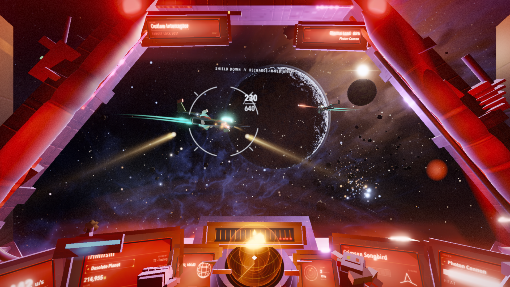
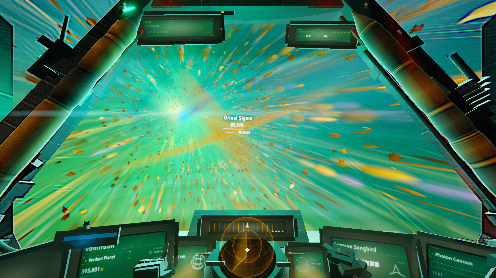
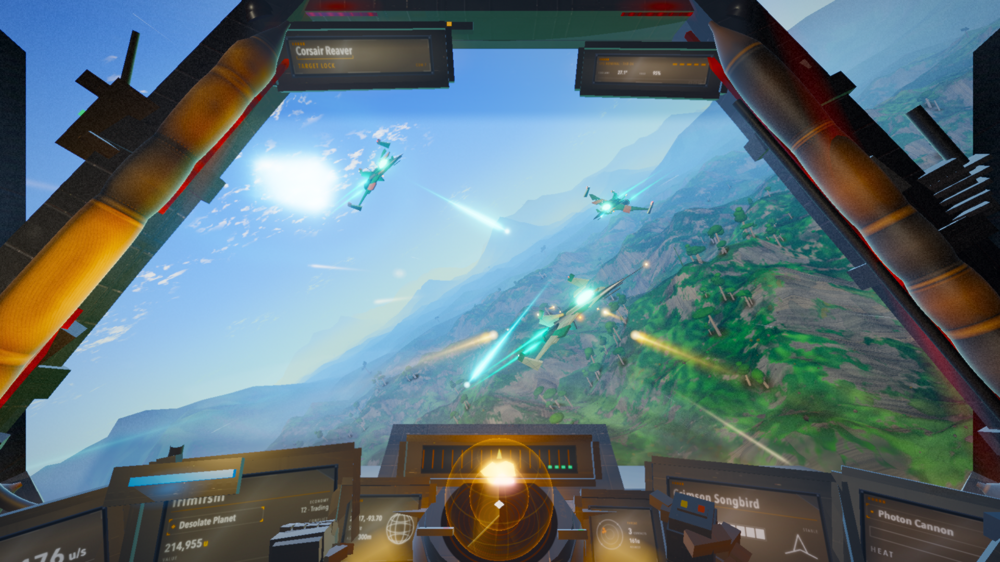
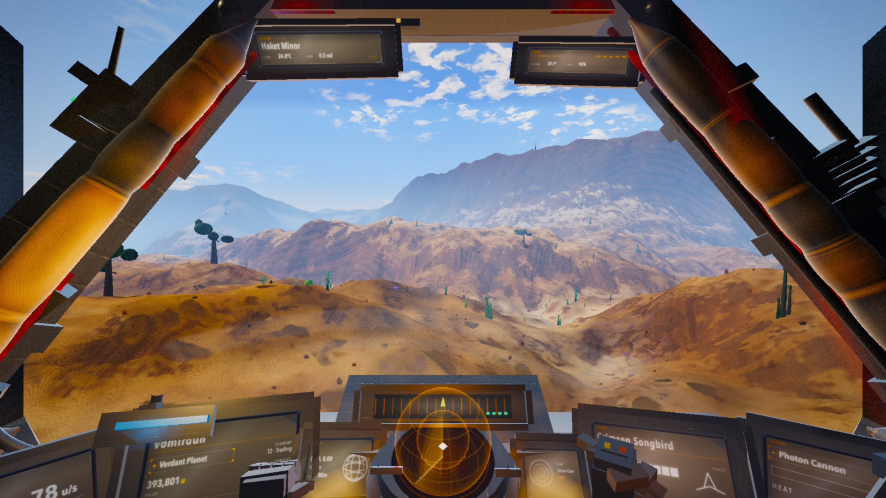

# Iridium Reach

A cockpit-view space shooter tech demo, built almost entirely by AI agents,
made in loving homage to [No Man's Sky](https://www.nomanssky.com/) — go play
the real thing, it's extraordinary.

Everything you see is procedural — every mesh, texture, planet, nebula and
sound effect is generated in code at runtime. No models, no image assets,
no audio files*, no build step. One HTML file, some ES modules, and three.js.

*except the ship's computer, who insisted on a real voice.

**[▶ Play it in your browser](https://jason-c-dev.github.io/iridium-reach-demo/)** — Chrome recommended, sound on.

## The game

Cruise a procedural star system, get ambushed by pirate raiders, manage a
heat-limited photon cannon, survive the red alert, warp out, repeat — each
system harder than the last.

- **Three enemy classes** — raiders, fast fragile interceptors, and a heavy
  gunship that hits like a bailiff
- **Ship systems** — shields that regenerate, a hull that doesn't, red
  alerts, and a ship you can genuinely lose
- **Scoring** — per-kill and wave bonuses, persistent high score
- **Cannon upgrades** — every wave cleared doubles your heat endurance,
  MK I through MK IV
- **Asteroids** — now with collision. Flying into rocks is no longer free
- **A ship's computer with attitude** — 49 voice lines across 16 events,
  performed in the finest tradition of sarcastic British AI. It will
  comment on your aim.

## Controls

| input | action |
|---|---|
| Mouse (hold LMB) | steer · fire |
| W / S | thrust · brake |
| A / D | roll |
| Arrow keys | pitch · yaw |
| Shift | boost |
| Space + Ctrl | brake-turn |
| F | fire |
| J | hyper jump (from a clear sky — no wave bonus, no upgrade) |
| Esc | pause · settings (mouse sensitivity, invert Y) |
| H | how to play (start / pause screens) |

Touch devices get on-screen controls: left stick to steer, ◀ ROLL / ROLL ▶
to bank, FIRE / BOOST / BRAKE hold buttons, a JUMP tap button, and a drag
THRUST slider.
TILT enables gyro steering (accelerometer fallback where the gyro is
unavailable) — hold the phone like a yoke, tap TILT once to enable (current
pose becomes center), ◎ re-centers mid-flight. The stick keeps working
alongside tilt.

## How to play

**Objective.** Survive pirate ambushes, clear each wave, and warp to the
next system — every system hits harder than the last. Kills and wave clears
score, your best score persists between runs, and a lost hull ends the run.

**The loop.** Cruise until raiders warp in → fight (shields absorb hits and
regenerate, the hull doesn't) → red alert means shields are down → clear the
wave to spin up the warp drive → ride the tunnel out and repeat. Drifting
close to a planet drops you into its atmosphere; climb out and pitch up to
leave.

**Ship systems.** Shields (100) regenerate after 5 s without damage; hull
(100) never does — unless you dock: five station bases orbit every system,
and inside a beacon bubble shields repair fast and the hull slowly.
The photon cannon builds heat per shot and locks out on overheat, so fire in
bursts — each cleared wave installs a cannon upgrade
(MK I → MK IV) that doubles heat endurance. Boost more than doubles top
speed; brake-turn tightens turns but bleeds speed. Asteroids are solid: a
head-on impact at speed strips a full shield. Press **J** on a clear sky to
hyper jump out early — you skip the fight, but also the wave bonus and the
upgrade.

**Hostiles.** Raiders are baseline chase fighters; interceptors are fast,
fragile strafers; gunships (system 2+) are slow, tanky, long-range turrets.

**Tips.** Watch the thermal gauge and ease off before overheat; hold
brake-turn to snap onto crossing targets; boost toward distant targets but
cut it before overshooting; Esc holds the sim (settings, controls, guide).

## How it was built

This game was built by a **gauntlet loop**: a fleet of AI agents (Claude
Code — a Fable 5 orchestrator managing Opus 5 workers) given a task, a build
method, and a deliberately unreachable bar — *"indistinguishable from real
No Man's Sky screenshots to a forensic judge."*

Each round, worker agents rebuilt subsystems in parallel git worktrees, each
paired with a harsh critic; blind judges then compared screenshots of the
build against real reference shots and filed forensic defect reports, which
seeded the next round. Fifteen rounds and four runs later the judges were
still winning — that bar is unreachable by design — but along the way the
loop produced a complete playable game, a 60fps render pipeline, a
deterministic capture harness, and one genuinely fooled judge.

The full write-up — including what the technique gets right, where its
returns diminish, and why the human playtester out-found the critic fleet at
the end — is coming as a blog post.

## Demo honesty

This is a tech demo, and it knows it:

- The ship's computer is a little chatty. We measured it (64% speech duty in
  combat). It stays, because it adds to the charm.
- The asteroid belt only exists in the first system. After one warp, space
  is rock-free — the collision system arrived before the level design did.
- Targets 60fps at 1080p; measured grazing the bar on an Apple M4. Your
  mileage may vary with GPU and browser.
- Best experienced in Chrome. Audio starts after your first click (browser
  autoplay rules).

## Credits

- **Code**: built by [Claude Code](https://claude.com/claude-code) agents in
  a gauntlet loop, directed and playtested by
  [Jason Croucher](https://github.com/jason-c-dev). MIT licensed.
- **Rendering**: [three.js](https://threejs.org) (MIT, vendored).
- **Station bases**: "Low-Poly Space Station - 3December" by
  [Šimon Ustal](https://sketchfab.com/simonustal) via Sketchfab,
  [CC Attribution](https://creativecommons.org/licenses/by/4.0/) —
  `assets/models/station.glb` (+ attribution sidecar). A procedural fallback
  station stands in if the GLB can't load.
- **Ship's computer**: voice lines generated with
  [ElevenLabs](https://elevenlabs.io) (voice: Callum). Distributed under
  ElevenLabs' terms, not MIT — see [LICENSE](LICENSE).
- **Inspiration**: the look and feel pay homage to
  [No Man's Sky](https://www.nomanssky.com/) by
  [Hello Games](https://hellogames.org/) — an amazing game the author plays
  and loves, and the bar fifteen rounds of AI critics never reached. Buy it,
  play it. This is an unaffiliated fan tech demo; it contains no assets from
  the game.
